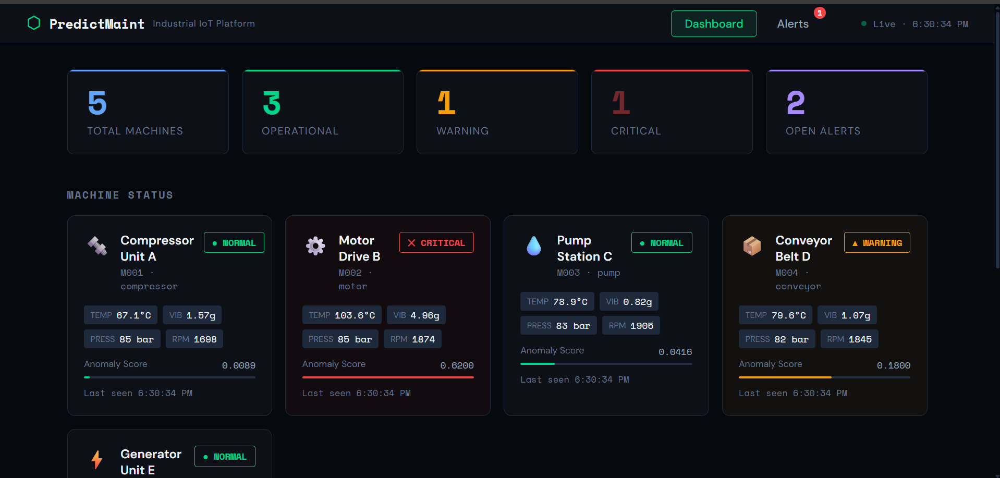
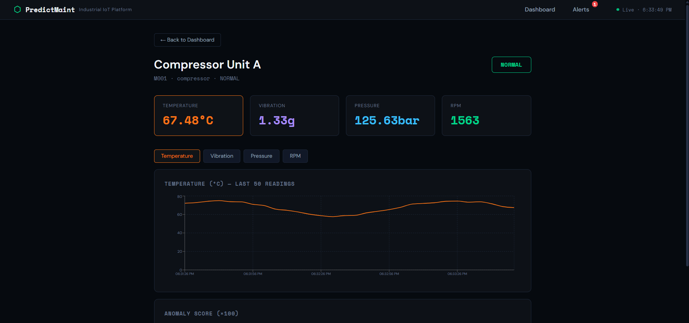

# 🚀 Predictive Maintenance IoT Platform
### Industrial IoT Monitoring & Predictive Analytics System

🌐 Live Demo:  
https://rutuja1221.github.io/predictive-maintenance-iot/

## Overview

This project is a cloud-ready Industrial IoT platform designed for real-time machine monitoring, anomaly detection, and predictive maintenance. The system simulates industrial sensor data, processes telemetry using AWS cloud services, and visualizes machine health through an interactive React dashboard.

---
### Main Dashboard


### Machine Analytics



## ✨ Features

- 📡 Real-time industrial sensor simulation
- 📊 Interactive React dashboard
- ⚠️ Predictive maintenance alerts
- 🔥 Critical fault monitoring
- ☁️ Cloud-ready AWS architecture
- 📈 Machine telemetry visualization
- 🚀 GitHub Pages deployment
- 🔄 CI/CD-ready workflow
- 🛠 Fault injection testing
- 📬 SNS-based critical alert notifications

---

## 🛠 Tech Stack

### Frontend
- React
- Vite
- Recharts

### Backend
- Python
- AWS Lambda
- API Gateway

### Cloud & DevOps
- AWS IoT Core
- DynamoDB
- GitHub Pages
- GitHub CI/CD

### Simulation
- MQTT
- AWSIoTPythonSDK
- Boto3

---

## 🏗 Project Architecture

```text
Sensor Simulator (Python)
       │  MQTT (port 8883)
       ▼
AWS IoT Core  ──────────────────────────────────────────────
       │  IoT Rule: SELECT * FROM 'factory/sensors/+'
       ▼
AWS Lambda: IoTSensorProcessor
       │  writes to
       ├──▶ DynamoDB: SensorReadings   (all readings, TTL 30 days)
       ├──▶ DynamoDB: MaintenanceAlerts (WARNING/CRITICAL events)
       └──▶ SNS Topic  (email on CRITICAL)

API Gateway (REST)
       │  routes: /machines  /readings  /alerts
       ▼
AWS Lambda: DashboardAPI
       │  reads from DynamoDB
       ▼
React Dashboard (S3 static website)
```

---

# ⚙️ Setup Guide

## Step 1 — AWS Account Setup (10 min)

1. Log in to AWS Console → switch region to **ap-south-1** (Mumbai)
2. Create an IAM user for Terraform:
   - IAM → Users → Create user → name: `terraform-iot`
   - Attach policy: `AdministratorAccess` (for project; restrict in production)
   - Create access key → download CSV
3. Install AWS CLI and configure:

```bash
aws configure
# Enter: Access Key ID, Secret Key, region=ap-south-1, format=json
```

---

## Step 2 — Deploy AWS Infrastructure with Terraform (15 min)

```bash
# Install Terraform:
# https://developer.hashicorp.com/terraform/downloads

cd iot-maintenance/backend

# Edit main.tf:
# - Change var.alert_email default to your email address

terraform init
terraform plan
terraform apply
# Type "yes" when prompted
```

After apply, note the output values:
- `api_gateway_url`
- `iot_endpoint_command`

These values are required for frontend and IoT configuration.

---

## Step 3 — Create IoT Device Certificate (10 min)

In AWS Console:

```text
IoT Core → Security → Certificates
```

Or via CLI:

```bash
mkdir -p backend/certs && cd backend/certs

aws iot create-keys-and-certificate \
  --set-as-active \
  --certificate-pem-outfile device.cert.pem \
  --public-key-outfile device.public.key \
  --private-key-outfile device.private.key

curl -o root-CA.crt \
https://www.amazontrust.com/repository/AmazonRootCA1.pem
```

Create an IoT policy named:

```text
SensorPolicy
```

IoT Policy JSON:

```json
{
  "Version": "2012-10-17",
  "Statement": [
    {
      "Effect": "Allow",
      "Action": ["iot:Connect"],
      "Resource": "*"
    },
    {
      "Effect": "Allow",
      "Action": ["iot:Publish"],
      "Resource": "arn:aws:iot:ap-south-1:*:topic/factory/sensors/*"
    }
  ]
}
```

---

## Step 4 — Configure Sensor Simulator (5 min)

Edit:

```python
backend/sensor_simulator.py
```

Update:

```python
IOT_ENDPOINT = "YOUR_ENDPOINT.iot.ap-south-1.amazonaws.com"
```

Get endpoint using:

```bash
aws iot describe-endpoint --endpoint-type iot:Data-ATS
```

Install dependencies and run:

```bash
cd backend

pip install AWSIoTPythonSDK boto3

# Console-only testing
python sensor_simulator.py --no-mqtt

# MQTT publishing mode
python sensor_simulator.py --interval 5
```

---

## Step 5 — Run the Dashboard Locally (5 min)

```bash
cd frontend
```

Create `.env` file:

```bash
echo "VITE_API_URL=https://YOUR_API_GATEWAY_URL/prod" > .env
```

Install dependencies and run:

```bash
npm install
npm run dev
```

Dashboard URL:

```text
http://localhost:5173
```

The dashboard also supports built-in mock data for offline demos.

---

## Step 6 — Deploy Frontend to GitHub Pages

```bash
cd frontend

npm install
npm run deploy
```

Live deployment:

```text
https://rutuja1221.github.io/predictive-maintenance-iot/
```

## 🎯 Demo Script (Viva)

1. Run sensor simulator in terminal
2. Show live sensor publishing
3. Open IoT Core MQTT subscription
4. Display dashboard machine cards
5. Trigger a manual fault
6. Show CRITICAL alert generation
7. Resolve active alert
8. Open machine detail charts

---

## 📚 Mapping to Course Material

| Platform Feature | Chapter Reference |
|-----------------|-------------------|
| Cloud-based sensor analytics | Ch.13 — Energy Systems Prognostics |
| Lambda + DynamoDB architecture | Ch.5 — Analytics App Reference Architecture |
| Auto-scaling infrastructure | Ch.5 — Scalability Design Consideration |
| IoT Rule → Lambda → DB | Ch.13 — Collecting Sensor Data in Cloud |
| Case-based anomaly scoring | Ch.13 — Case Based Reasoning |
| REST APIs | Ch.5 — RESTful Web Services |
| Deployment & Management | Ch.5 — Cloud Deployment |

---

## 🚀 Future Enhancements

- Real-time WebSocket integration
- Live AWS IoT Core connectivity
- Machine learning anomaly prediction
- Email/SMS alert automation
- Docker containerization
- Kubernetes deployment
- CI/CD automation with GitHub Actions
- Role-based authentication
- Historical analytics dashboard

---

## 📄 License

This project is developed for educational and academic purposes by Rutuja.
